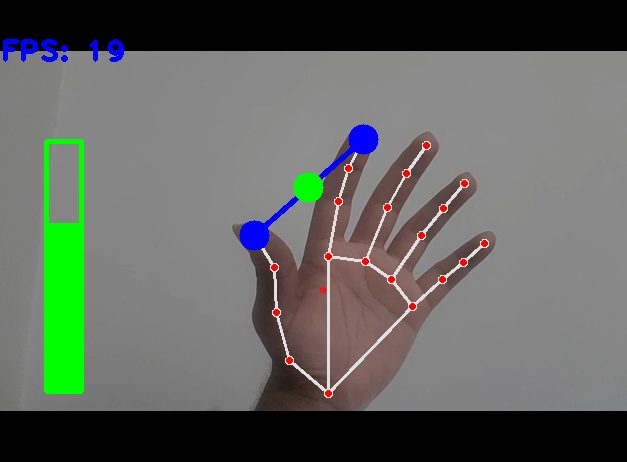

# Volume Hand Control 🎧🖐️

Control your system's audio volume using hand gestures through your webcam! This project uses computer vision and audio control libraries to let you adjust the volume by changing the distance between your thumb and index finger.



## Features

- Real-time hand tracking using MediaPipe
- Adjust volume based on the distance between two fingers
- Visual feedback with landmarks, connections, and volume bar
- FPS counter for performance tracking

## How It Works

- The system detects your hand and landmarks using MediaPipe.
- It calculates the Euclidean distance between the thumb tip and index finger tip.
- This distance is mapped to the system's volume range using Pycaw.
- Visual feedback is displayed via OpenCV, including:
  - Detected hand skeleton
  - Circles on fingertips
  - Green/red indicators for volume threshold
  - Live volume bar and FPS

## Requirements

- Python 3.7+
- OpenCV
- MediaPipe
- NumPy
- Pycaw
- comtypes

Install dependencies with:

```bash
pip install opencv-python mediapipe numpy pycaw comtypes
```

## Getting Started

1. Clone the repository:

```bash
git clone https://github.com/your-username/volume-hand-control.git
cd volume-hand-control
```

2. Run the main script:

```bash
python VolumeHandControl.py
```

3. Make a "pinch" gesture (thumb + index) and move your fingers closer or further apart to control the volume.

## Project Structure

```text
├── VolumeHandControl.py      # Main script
├── HandTrackingMin.py        # Minimal code for hand tracking
├── HandTrackingModule.py     # Utility module for hand detection
├── image.png                 # Demo screenshot
```

> Make sure your webcam is connected and accessible.

## Image Reference

The `image.png` shows a hand with landmarks, volume bar, and FPS. Blue dots are thumb and index, green indicates mid-point, and red circle appears when volume is muted (fingers very close).

## Troubleshooting

- **Low FPS?** Close background apps and ensure your camera resolution is supported.
- **No hand detected?** Check lighting and camera angle.
- **Permissions?** Make sure your system allows access to the camera.


---

Enjoy touchless volume control! ✋🔊
